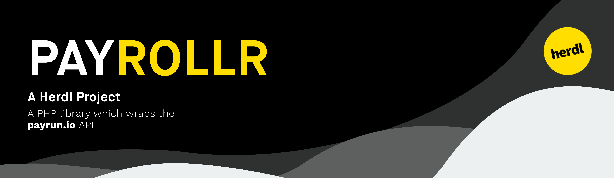

[](https://circleci.com/gh/herdl/payrollr/tree/develop)
[](http://hits.dwyl.io/herdl/payrollr)
[](https://github.com/herdl/payrollr/graphs/commit-activity)
[](https://github.com/herdl/payrollr/releases/)
[](http://makeapullrequest.com)
[](https://github.com/herdl)

# Payrollr
A PHP library which wraps the payrun.io API

## Prerequisites
The following is a list of prerequisites for Payrollr.
```
PHP Version >= 7.2.0
```

### Installation

To install this library locally we recommend using [Composer](https://getcomposer.org/).

You can use `composer require herdl/payrollr` to get the latest released version of the project. 

The above command will pull [this version](https://github.com/herdl/payrollr/releases/latest) of the project locally.

## We're Using
* [PHP](http://www.dropwizard.io/1.0.2/docs/) - The primary programming language
* [Composer](https://getcomposer.org/) - Dependency Management

## Contributing
It is worth noting that all contributions must comply with the [PSR-2 standards](https://github.com/php-fig/fig-standards/blob/master/accepted/PSR-2-coding-style-guide.md)

## Versioning
We use [SemVer](http://semver.org/) for versioning. For the versions available, see the [tags on this repository](https://github.com/herdl/payrollr/tags). 

## Authors
* **Alex Blackham** - *Developer and Maintainer* - [B3none](https://github.com/b3none)
* **Mat Moses** - *Logo creation* - [mooonthemove](https://instagram.com/mooonthemove)

See also the list of [contributors](https://github.com/herdl/payrollr/contributors) who participated in this project.

## License
This project is licensed under the MIT License - see the [LICENSE.md](LICENSE.md) file for details
